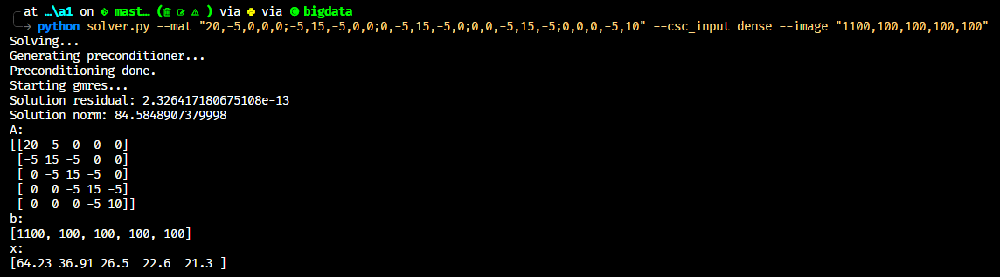
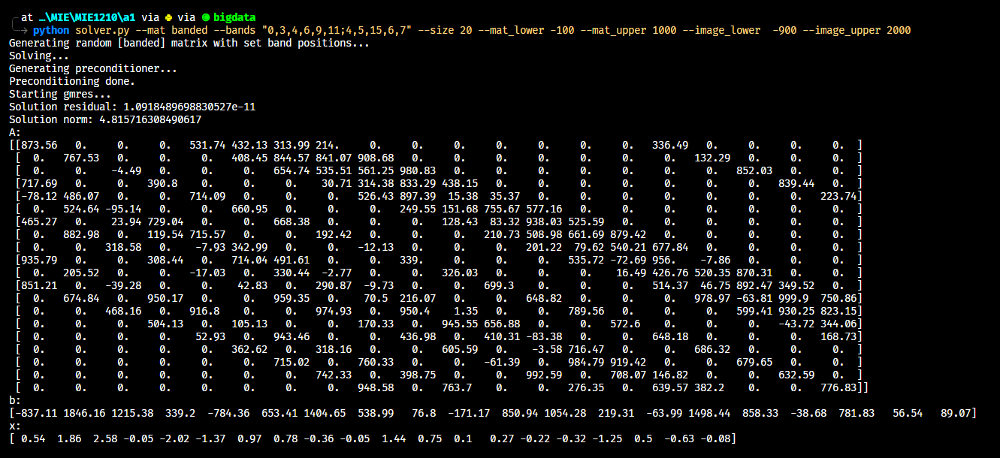
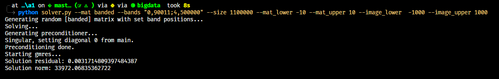
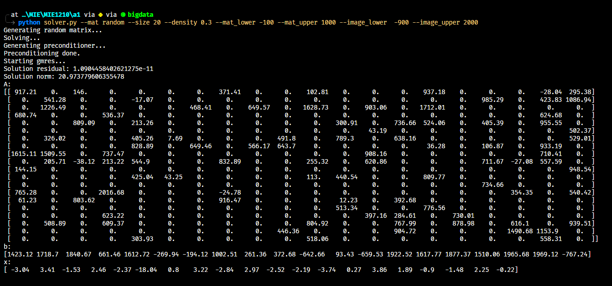
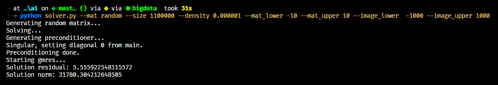

# Sparse Matrix Solver

Solves ${\bf Ax}= {\bf b}$ iteratively and approximately using **GMRES** and the **spilu** preconditioner from scipy.

### Examples

- `python solver.py --mat "20,-5,0,0,0;-5,15,-5,0,0;0,-5,15,-5,0;0,0,-5,15,-5;0,0,0,-5,10" --csc_input dense --image "1100,100,100,100,100"`

- `python solver.py --mat banded --bands "0,3,4,6,9,11;4,5,15,6,7" --size 20 --mat_lower -100 --mat_upper 1000 --image_lower  -900 --image_upper 2000`

- `python solver.py --mat banded --bands "0,90011;4,500000" --size 1100000 --mat_lower -10 --mat_upper 10 --image_lower  -1000 --image_upper 1000`

- `python solver.py --mat random --size 20 --density 0.3 --mat_lower -100 --mat-upper 1000 --image_lower -900 image_upper 2000`

- `python solver.py --mat random --size 1100000 --density 0.000001 --mat_lower -10 --mat_upper 10 --image_lower  -1000 --image_upper 1000`
